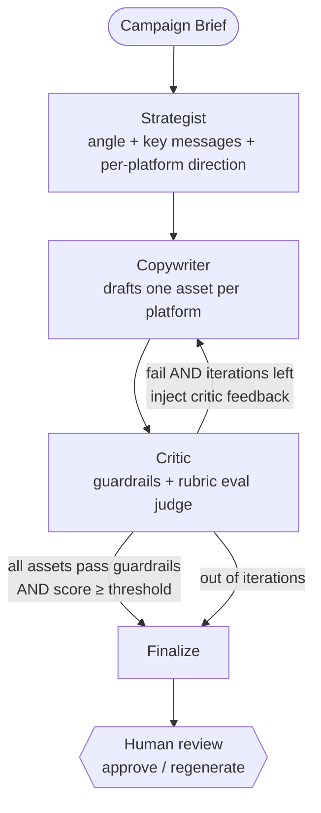

# Agentic Digital Marketing Copilot

Turn a **campaign brief** into **platform-specific marketing copy** through a
multi-agent loop that *critiques and revises its own work*, gates every asset on
a quality score, and never finalizes anything without a human's approval.

The copy generation is the easy part. This project exists to demonstrate the
**engineering around** the LLM:

| Pillar | What it means here | Where |
|---|---|---|
| 🤖 **Multi-agent orchestration** | A real copywriter ↔ critic revision loop with a max-iteration guard — not a single prompt. | [`app/graph/build.py`](backend/app/graph/build.py) |
| 🛡️ **Guardrails** | Pydantic schema validation on every agent I/O **+** deterministic brand-safety checks (banned / absolute / medical / financial claims). | [`app/guardrails/checks.py`](backend/app/guardrails/checks.py) |
| 📊 **Evaluation** | A rubric LLM-as-judge scores each asset; a documented weighted `overall` **gates the loop**. Calibrated against a hand-labeled golden set. | [`app/agents/critic.py`](backend/app/agents/critic.py), [`app/eval/`](backend/app/eval) |
| 🧑‍⚖️ **Human-in-the-loop** | Nothing is "final" without explicit approve; regenerate re-runs the loop for one asset and resets approval. | [`app/routers/campaigns.py`](backend/app/routers/campaigns.py) |

---

## Architecture



The **conditional edge** after the critic is the heart of the system. It is a
pure function (`route_after_critic`) so it is unit-tested in isolation:

- **all assets** clear guardrails **and** meet the score threshold → finalize
- otherwise, **iterations remaining** → revise (back to the copywriter, *with the
  critic's feedback injected* so it actually improves)
- otherwise → finalize the best-so-far and raise `needs_human_attention`

### Request flow

```
POST /campaigns ─────────► persist brief (SQLite)                → { id }
GET  /campaigns/{id}/stream ─► run graph, stream agent steps over SSE,
                               persist scored + guardrail-checked assets
GET  /campaigns/{id} ───────► brief + assets (each w/ score + critic notes)
POST .../assets/{platform}/approve ───► human gate
POST .../assets/{platform}/regenerate ► re-run the loop for one platform
```

---

## Tech stack

- **Backend:** Python 3.12, FastAPI (async), SSE via `sse-starlette`
- **Orchestration:** LangGraph
- **Validation:** Pydantic v2 (every agent boundary is a typed model)
- **LLM:** provider-agnostic behind a thin client; default **Google Gemini**
  (`google-genai`), model env-driven — swap providers without touching logic
- **Persistence:** SQLite via SQLModel (async, `aiosqlite`)
- **Frontend:** React + Vite + TailwindCSS — brief form → live SSE progress → review/approve
- **Packaging:** Docker + docker-compose; CI via GitHub Actions (ruff + black + pytest)

---

## Repository layout

```
backend/
  app/
    main.py            FastAPI app + /health, lifespan DB init
    config.py          env-driven settings (no hardcoded model strings)
    models.py          typed agent contracts (Brief, Asset, EvalScore, ...)
    llm/
      client.py        thin, swappable LLM client (JSON-validated, repair-once)
      prompts/         one prompt module per agent
    agents/            strategist, copywriter, critic
    guardrails/        deterministic brand-safety checks
    graph/             LangGraph state + build (the loop)
    eval/              golden set + calibration runner
    routers/           campaign API
    services/          orchestrator (graph → stream events)
    store.py, db.py    SQLModel tables + async session
  tests/               61 tests, no LLM calls (fakes + temp DB)
  Dockerfile, fly.toml
app/                   React + Vite + Tailwind frontend
  src/
    api.js             fetch + SSE client
    App.jsx            brief → run → review state machine
    components/        BriefForm, RunProgress, ReviewCards, ui
docker-compose.yml
.github/workflows/ci.yml
```

---

## Getting started (local)

### 1. Configure
```bash
cp .env.example .env
# set GEMINI_API_KEY (from Google AI Studio) for real generation
```

### 2. Run with Docker (recommended)
```bash
docker compose up --build
# http://localhost:8000/health   →  {"status":"ok", ...}
# http://localhost:8000/docs     →  interactive API
```

### 3. Or run natively
```bash
# backend
cd backend
python -m venv .venv && source .venv/bin/activate   # Windows: .venv\Scripts\activate
pip install -e ".[dev]"
uvicorn app.main:app --reload                        # http://localhost:8000

# frontend (separate terminal)
cd app
npm install
npm run dev                                          # http://localhost:5173 (proxies /api → :8000)
```

---

## Try it

```bash
# 1. Submit a brief
curl -s -X POST http://localhost:8000/campaigns \
  -H 'content-type: application/json' \
  -d '{
        "brand":"TaskFlow","product":"TaskFlow",
        "goal":"drive signups","audience":"busy founders",
        "tone":"confident, friendly","platforms":["linkedin","instagram"],
        "brand_guidelines":"No absolute or unverifiable claims."
      }'
# → {"id":"...","stream_url":"/campaigns/<id>/stream"}

# 2. Watch the agents work (SSE), then assets are persisted
curl -N http://localhost:8000/campaigns/<id>/stream

# 3. Fetch results, then approve or regenerate one asset
curl -s http://localhost:8000/campaigns/<id>
curl -s -X POST http://localhost:8000/campaigns/<id>/assets/linkedin/approve
curl -s -X POST http://localhost:8000/campaigns/<id>/assets/linkedin/regenerate
```

---

## Evaluation: showing the judge is calibrated

A small hand-labeled **golden set** ([`app/eval/golden.py`](backend/app/eval/golden.py))
pairs briefs + assets with expected pass/fail. The runner scores them through the
real critic and reports accuracy + a confusion matrix:

```bash
cd backend
python -m app.eval.runner    # needs GEMINI_API_KEY
```

The dataset is deliberately mixed: banned-claim cases are caught by the
deterministic guardrail layer **alone** (no LLM needed), while off-tone / weak-CTA
cases exercise the judge. A test asserts that any case which trips a deterministic
guardrail is labeled `expected_pass=False`, so the labels can't silently drift.

---

## Testing & quality

```bash
cd backend
pytest -q          # 61 tests, no network / API key required
ruff check .       # lint
black --check .    # format
```

The suite covers the pieces that matter for interviews: the **conditional-edge
routing**, the **guardrail checks**, the **eval judge parsing**, the
**repair-once-then-raise** LLM contract, and the full **API + SSE + persistence**
flow (with a stubbed orchestrator and a temp DB — zero LLM calls).

---

## Deploy (Fly.io)

SQLite needs a persistent disk, which Fly volumes provide.

```bash
cd backend
fly launch --no-deploy                 # pick a unique app name
fly volume create copilot_data --size 1
fly secrets set GEMINI_API_KEY=your-key
fly deploy
```

The container starts as root only long enough for its entrypoint to chown the
mounted volume, then drops to a non-root user to run the app.

---

## Design notes

- **No free-form strings cross an agent boundary** — every input/output is a typed
  Pydantic model; the LLM client validates JSON against the expected model and
  repairs once before raising.
- **The score that gates the loop is computed, not trusted.** The judge returns
  four 1–5 rubric dimensions; `EvalScore.overall` is recomputed from documented
  weights, ignoring any value the model supplies.
- **A guardrail failure forces a revision regardless of score** — guardrails and
  the rubric score are kept as separate outputs.
- **Provider-swappable by design:** a provider SDK is imported only inside the LLM
  client; everything else is provider-agnostic.

---

## Roadmap (v2)

Clean seams are left for: a research agent + web search, brand-voice RAG over past
content, a LiteLLM cost-routing gateway (cheap drafts / strong finals), Langfuse
tracing + prompt versioning, A/B variant generation, and a social-publishing layer
via MCP tools — always **draft → human approves → publish**, never auto-publish.
